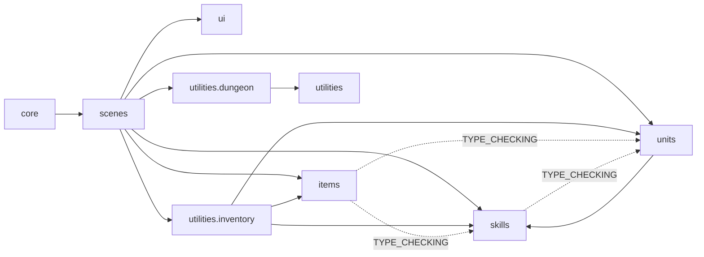

# 모듈 책임과 의존성

## 영역별 소유권

| 영역 | 소유하는 책임 | 의존하지 않아야 하는 영역 |
|---|---|---|
| `core` | 실행 루프, 입력 수집, 화면과 사운드 환경 | 개별 UI 구현과 게임 모델 내부 규칙 |
| `scenes` | 화면 흐름, 입력 세션, 월드 좌표와 모델·UI 조정 | 모델 내부 계산의 복제 |
| `ui` | 표시와 UI 상호작용 | 구체 scene의 숨은 속성 계약 |
| `units` | 기초 능력치, 런타임 전투 상태, 피해 계산 | scene, UI, 아이템 보관 상태 |
| `skills` | 스킬 기반 정의, 방향·범위 정책, 공통 효과와 스킬 인스턴스 및 실제 스킬 구현 | scene, UI, 입력 장치 상태 |
| `items` | 아이템 기반 계층과 실제 아이템·장비 콘텐츠 구현 | scene, UI, 인벤토리 컬렉션 |
| `utilities` | 한 scene에 두기에는 규모가 크거나 여러 영역에 걸치는 기능 | 개별 scene에 한정된 화면 흐름 |
| `utilities.inventory` | 아이템 보관, 장비 슬롯, hotbar 연결과 플레이어의 던전 진행 상태 | scene, UI, 입력 장치 상태 |
| `utilities.dungeon` | seed 기반 방 배치, 통로 연결, 계단 위치와 던전 맵 결과 및 전투 행동 타이머 | scene, UI, 인벤토리 상태 |

## 의존성 원칙

- `DungeonScene`은 현재 층의 `ground_items`(좌표 → `ItemInstance` 목록)와 `tile_interactions`(좌표 → `callback(scene)`)를 소유한다. `T` 입력은 `interact_with_current_tile()`로 전달하며, 아이템 보관 성공 여부는 `DungeonInventory.add_item()`에 위임한다. 아이템이 있는 타일은 줍기만 처리하고 이벤트는 다음 입력에서 실행한다. 이벤트의 일회성 여부와 행동 시간 비용은 callback이 관리하며, 현재 줍기 자체는 전투 시간을 진행하지 않는다.

- 상위 조정 계층인 scene은 모델과 UI를 함께 알 수 있지만, 모델은 scene을 import하지 않는다.
- scene 전용 UI라도 필요한 데이터와 callback을 생성자에서 명시적으로 받는다. renderer가 `scene.player` 같은 속성을 임의로 탐색하지 않는다.
- 공용 `SkillCard`와 `SkillInfoWindow`는 `SkillInstance`만 받아 표시하며 스킬 투자 정책을 포함하지 않는다. 티어 포인트 투자는 인벤토리 scene 전용 `SkillInvestButton`이 `DungeonInventory`에 요청한다.
- 공용 `ShortcutBar`와 `ShortcutSlot`은 던전과 인벤토리에서 동일한 단축키 표현을 제공한다. scene은 getter와 클릭 callback으로 내용과 동작을 전달하고 위치·열·슬롯 크기·간격만 화면별로 구성한다.
- 공용 `ItemWindow`는 `ItemInstance` getter만 받아 인벤토리 슬롯과 단축키 슬롯에서 재사용한다. 구체 아이템 이름·설명·플레이버 문구는 각 `Item` 클래스가 소유하고, 드롭된 장비의 상세 행은 `EquipmentInstance`가 소유한다.
- 아이템과 스킬 이미지는 공용 코드 스프라이트 로더를 사용한다. 각각 `item_code`와 `skill_code`를 파일명으로 삼아 `assets/images/items`, `assets/images/skills`에서 PNG를 찾고 캐시하며, 파일이 없으면 코드 기반 색상의 사각형 대체 이미지를 생성한다.
- `RandomGenerator`는 현재 난수만 내부 상태로 보관한다. 난수를 발급할 때 현재 상태로 출력값과 다음 상태값을 만들고 다음 상태값을 저장하므로, 같은 seed에서 같은 결과열을 재현할 수 있다.
- 게임 진입 중 선택한 고정 seed는 `Game`이 실행 범위의 공통 상태로 보관한다. 게임을 시작하면 선택했거나 새로 만든 게임 seed를 `DungeonInventory.game_seed`에도 기록한다. 저장 파일에는 기록하지 않으며 취소, 상태 마커 클릭 또는 게임 종료 시 사라진다.
- `DungeonInventory`는 게임 seed로 임시 최대 층수인 10개 층의 난수를 미리 발급해 값으로 보관한다. 각 층 난수에서는 맵·적·아이템·전투용 seed를 순서대로 분리하고, 용도별 `RandomGenerator` 인스턴스를 층별로 보관해 한 영역의 난수 소비가 다른 영역의 결과열에 영향을 주지 않게 한다. 층 번호를 받는 getter는 1부터 시작하며, 현재 던전 맵은 1층의 맵 난수 생성기로 만든다.
- `DungeonMapGenerator`는 주입받은 `RandomGenerator`로 8~12개의 방과 굽은 통로를 생성한다. 최소 신장 트리와 추가 간선으로 연결·순환을 보장하고, 계단이 아닌 큰 방 하나를 서로 다른 3개 이상의 면으로 연결되는 hub로 사용한다. 통로는 지정된 출입구에서만 방과 접촉하며, 각 방의 상하좌우 경계를 1칸씩 확장한 전체 사각형을 금지 영역으로 사용해 방 모서리의 대각선 칸에도 벽을 남긴다. 먼저 확정된 통로와 같은 방향의 선분이 바로 옆 칸에서 평행하게 이어지는 경로도 거부해 서로 다른 통로가 나란히 붙어 2칸 너비로 뚫리지 않게 하며, 통로 교차는 허용한다. 모든 통로를 합친 뒤에는 각 방의 네 벽 바깥을 다시 검사해 연속된 두 칸 이상이 바닥이면 해당 배치를 폐기한다.
- DungeonMap은 지형·방·통로·계단 좌표와 변경 가능한 플레이 상태를 함께 보관한다. player는 인벤토리와 공유하는 Player 참조이며 player_position은 해당 유닛의 현재 좌표를 반환한다. enemies는 Enemy 인스턴스 목록으로 좌표, HP/MP, 버프, AI 모드, 순찰 목표와 마지막 플레이어 목격 위치를 보관한다. combat_timer도 맵이 소유해 적의 남은 행동 시간과 턴 카운터를 유지한다. 지형 tiles는 튜플이며 map 속성은 격자 복사본을 반환한다. 정규화된 맵의 상하좌우 최외곽은 최소 2칸 두께의 벽으로 둘러싸며, 플레이어는 올라가는 계단에서 시작하고 층 이동은 아직 수행하지 않는다.
- 스탯 패시브 탭의 `PassiveSkillGrid`는 `DungeonInventory.passive_skills()` 결과를 공용 `SkillCard`로 격자 배치하며, 적용 여부나 중첩 계산을 UI에서 다시 구현하지 않는다.
- `DungeonInventory`는 영웅과 장비에서 모은 동일 코드의 스킬 레벨을 하나로 합산하고, 스킬 정의에 최대 레벨이 있으면 합산 결과를 그 상한으로 제한한다.
- `DungeonInventory`가 생성한 `Player`를 `DungeonMap.bind_player()`로 연결한다. 맵과 인벤토리는 동일한 유닛을 참조하므로 인벤토리를 통한 이동·피해·회복이 맵에서도 즉시 반영된다. scene은 적의 원본 상태를 맵에 보관하고 유닛 참조와 renderer를 묶은 화면 목록만 관리한다. 최초 진입 시에만 초기 몬스터를 생성하며, initialized 상태인 맵을 다시 열면 기존 적과 행동 타이머를 재사용한다. 제거된 적은 맵 목록과 타이머에서도 제거한다. 기존 dict 맵은 DungeonMap.from_tiles()로 변환한다. 이 보관은 메모리 기준이며 파일 저장·층 전환은 아직 구현하지 않는다.
- `DungeonInventory.explored_tiles_by_floor`는 한 번의 던전 진행 동안 층별 발견 타일 좌표를 소유한다. scene과 지도 UI는 직접 집합을 수정하지 않고 `explore_tiles(...)`와 `get_explored_tiles(...)`를 사용한다.
- `utilities.dungeon.sight`는 플레이어와 몬스터가 공유하는 현재 시야를 계산한다. 방 밖에서는 정사각형 반경 4칸 안에서 기준 위치와 각 타일 사이의 격자 직선 시야를 검사한다. 목표 벽은 보이지만 중간 벽 뒤와 맞닿은 두 벽의 대각선 틈 너머는 보이지 않는다. 현재 보이는 바닥에 직접 닿은 8방향 벽 타일은 추가로 밝혀 통로 윤곽을 표시하되 벽 너머 지형까지 연쇄적으로 밝히지 않는다. 생성 맵의 방 안에서는 이 차단 규칙과 별도로 방 바닥 전체와 바깥 경계벽 한 겹을 밝힌다. `DungeonScene`은 플레이어 기준 결과를 인벤토리의 발견 기록에 누적하며, 카메라 렌더 범위는 시야 및 발견 범위와 별도로 계산한다.
- `DungeonFogRenderer`는 현재 시야 밖의 발견 지형을 하나의 화면 크기 알파 레이어에 합친 뒤, 현재 시야의 바닥·벽 화면 영역을 다시 투명하게 지우고 한 번만 blit한다. 높이가 큰 시야 밖 벽이 방 경계벽 위로 겹치거나 벽과 바닥의 필터 알파가 누적되지 않으며, 스킬 대상 필터는 타일 renderer의 별도 상태로 관리한다. 몬스터는 현재 시야 안에서만 렌더링하고 hover할 수 있다.
- 미니맵과 `MapScene`은 `DungeonInventory`의 발견 좌표와 던전 맵의 방·연결 정보를 입력받는다. 발견한 방은 사각형 외곽선, 통로는 생성 경로의 중심선으로 표시하며 통로를 먼저 그린 뒤 방을 덮어 출입구 선이 방 내부로 돌출되지 않게 한다. 방 정보가 없는 dict 맵만 발견 타일의 인접 중심선을 사용한다. 지도 UI는 탐험 상태를 소유하거나 변경하지 않는다.
- 던전 맵 데이터에는 올라가는 계단과 내려가는 계단 위치를 포함하며, 플레이어는 올라가는 계단 좌표에서 시작한다.
- `DungeonScene.combat_timer`는 플레이어·몬스터의 다음 행동까지 남은 정수 틱과 절대 시점을 저장하지 않는 `TurnCounter`를 관리한다. `TurnCounter`는 0~99 범위만 유지하고 100틱을 넘길 때마다 완료된 행동 구간 수를 반환하며, `CombatTimer.last_completed_turns`는 가장 최근 진행에서 통과한 구간 수를 노출한다. 속도 단계 `N`의 기본 행동 비용은 `int(2 ** (-N / 3) * 100)`이며, 플레이어 이동이 완료되면 합산 이동 속도의 행동 비용만큼 카운터와 유닛 타이머를 진행한 뒤 플레이어를 다시 예약한다. 전투 타임라인은 플레이어의 다음 공격·이동과 현재 시야 안 생존 몬스터 각각의 다음 행동 한 번을 시간순으로 합쳐 최대 8개의 휘장만 표시한다.
- `MonsterSpawner`는 층별 적 전용 난수 생성기로 일반 바닥 중 소환 가능한 좌표만 선택한다. 첫 진입에는 현재 시야·플레이어·계단·생존 몬스터를 피해 3~5마리를 배치하고, 이후 완료된 100틱 구간마다 15% 확률로 1마리를 추가하되 생존 몬스터는 10마리를 넘기지 않는다. `DungeonScene`은 좌표 선택 결과를 받아 실제 유닛·renderer·전투 타이머를 생성한다.
- `utilities.dungeon.navigation`은 벽과 동적 점유 칸을 피해 시작점을 제외한 8방향 최단 경로를 반환한다. 양쪽 직교 칸이 모두 막힌 대각선 모서리는 통과하지 않는다. `Enemy`는 기본 보초 모드에서 적 전용 난수 흐름으로 도달 가능한 일반 바닥 목적지를 선택하고 한 행동에 한 칸씩 이동한다. 행동 직전 공용 시야에서 플레이어를 발견하면 마지막 목격 위치를 기억하고 전투 모드로 전환해 인접 칸까지 추적한다. 시야를 잃어도 마지막 목격 위치까지 전투 모드로 이동하며, 해당 위치에 도착한 뒤에도 플레이어가 보이지 않을 때만 기억을 지우고 보초 모드로 돌아간다. 플레이어 이동 비용을 진행하는 동안 준비된 적은 등록 순서대로 모두 행동하고 각자의 이동 비용으로 다시 예약된다.
- 던전 HUD와 몬스터 인스펙트의 플레이어 능력치 표시는 `DungeonInventory.player`를 직접 계산에 사용하지 않고 `DungeonInventory.get_stat()`의 합산 결과를 읽는다.
- 여러 컬렉션을 함께 변경하는 장착·해제·아이템 및 액티브 스킬 단축키 연결은 `DungeonInventory`가 한 번의 연산으로 처리한다.
- `SkilledEquip` 원형은 드롭 시 사용할 기본 스킬 행만 제공한다. `EquipmentInstance`는 생성 시 이를 7행의 `stat_rows`로 깊은 복사하며, 이후 장비 설명과 패시브 합산은 원형이 아니라 인스턴스 행만 읽는다.
- `LearnableSkill(tier, skill, max_level)` 목록이 영웅이 던전에서 배울 수 있는 스킬 구조다. 항목별 `max_level`은 스킬 정의 자체의 최대 레벨 이하에서 별도의 투자 상한을 제공하며, 스킬 정의와 학습 항목에서 `None`은 무제한을 뜻한다. 티어별 전용 포인트는 `DungeonInventory`가 소유하고 투자는 해당 티어 포인트만 소비한다.
- 타입 힌트만 필요한 반대 방향 의존성은 `TYPE_CHECKING` 아래에서 직접 소유 모듈을 참조한다.
- package `__init__.py`는 다른 패키지가 소유한 타입을 편의상 재공개하지 않는다.
- 실제 아이템 콘텐츠는 `items/items`, 장비 콘텐츠는 종류별 `items/equips` 하위 폴더에 둔다. 실제 스킬 콘텐츠는 `skills/implementations/{item_skills,active_skills,passive_skills}`에 두어 기반 모델과 구현체를 경로상으로 구분한다.
- 여러 스킬이 공유하는 효과 구현은 `skills/effect_classes.py`에 모으고, 한 스킬에서만 필요한 전용 효과는 해당 스킬 구현 파일 안에 둔다.
- 스킬 시전은 `SkillCastContext`로 스킬 정의, 합산 레벨, 시전자와 대상을 효과에 전달한다. 스킬이 제공하는 선택적 계산 callable은 `AttackEffect`가 `DamageBlock`으로 넘기며, callable이 없는 계산 단계는 `Unit`의 기본 피해 공식을 사용한다.

## 현재 남은 경계

- `DungeonScene`의 hotbar 스킬은 아직 대상 타일 계산 단계까지만 구현되어 있다. 실제 다중 대상 효과 실행과 비용 지불 정책은 별도 전투 실행 계층이 필요하다.
- `InventoryScene`은 dungeon 전용 overlay이므로 현재 부모 scene에서 `dungeon_inventory`를 읽는다. 다른 부모 scene에서 재사용할 필요가 생기면 이를 생성자 입력으로 전환한다.
- 일부 scene별 renderer는 폰트와 표시 상태를 scene에서 직접 읽는다. 재사용 가능성이 생기는 시점에 데이터 또는 getter 입력으로 전환한다.

- 합성 화면의 메인·재료 인스턴스 선택은 별도 overlay인 `SynthesisScene`의 임시 상태다. `InventoryScene`은 던전 인벤토리와 선택 장비를 전달하여 합성창을 연다. `SynthesisPanel`은 getter와 재료 해제 callback을 받아 슬롯과 결과 장비를 보여 주는 공용 `ItemWindow` 정보창을 표시하고, UI는 직접 인벤토리나 장비 데이터를 변경하지 않고 합성 실행을 `DungeonInventory`에 요청한다. 두 화면은 `ui/global`의 `ItemSlot`과 `InventorySlot` 기반을 공유한다.

- `SkilledEquip.synthesize_rows()`는 스킬 코드·레벨 비교, 합성 행 정렬 및 7개 이상 거부를 소유한다. `EquipmentInstance.synthesis_preview()`는 원본 인스턴스 행을 사용해 독립적인 결과 복사본과 의미별 행 분류를 반환한다. `SynthesisScene`은 선택 시 결과를 계산하고 행 분류를 UI 색상으로 매핑한다. `ItemWindow`는 선택적 행 색상 getter를 받아 이름과 레벨에 적용한다.

- 공용 `ItemWindow`의 선택적 `scrollable` 모드는 본문 줄바꿈·클리핑·휠 입력·스크롤 범위를 관리한다. 합성 결과창만 이를 활성화하며 스킬 색상과 고정 제목을 유지한다.

- `DungeonInventory`는 골드(`gold`)와 조화석(`harmony_stones`) 보유량을 0부터 관리한다. 공용 `CurrencyBar`는 getter로 인벤토리를 받아 현재 값을 매번 읽고 장비 탭 오른쪽 하단에는 오른쪽 정렬하고, 합성창에서는 개별 중심 좌표를 받아 골드·조화석을 각각 메인·재료 장비 칸 아래에 중앙 정렬한다. 재화는 일반 아이템 슬롯과 분리된다.

- `EquipmentInstance.synthesis_cost()`는 결과 행의 분류와 레벨로 조화석 비용을 계산한다. `DungeonInventory.synthesize_equipment()`는 소유·규칙·잔액 검증을 모두 마친 뒤 재료 제거, 메인 행 적용, 조화석 차감과 재료의 단축키 참조 정리를 수행한다. 미리보기는 원본을 바꾸지 않으며 실행 시 다시 계산한다.

- 합성 거부 안내의 위치·페이드 렌더링은 `MaterialNotice`가 담당하고, `SynthesisScene`은 거부 사유와 해당 슬롯 영역을 전달하며 프레임 시간으로 표시 수명을 갱신한다.

- `SynthesisScene`은 초기화와 합성 성공 후 도메인의 `synthesis_preview()`로 재료 선택 가능 인스턴스를 계산해 슬롯 명도에 반영한다. `InventoryTabButton`은 선택적 `enabled_getter`와 `emphasized`를 지원하며 합성창에서 비활성 클릭 차단과 실행 버튼 강조에 사용한다.
