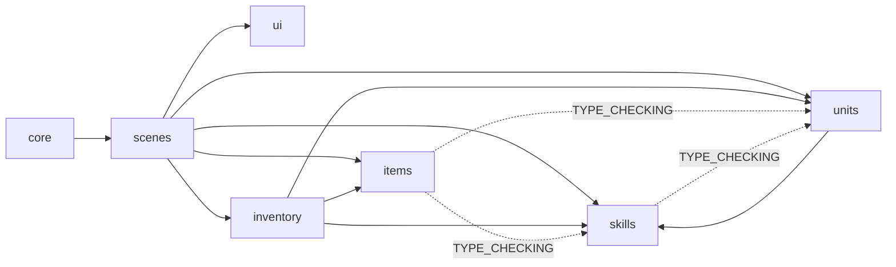

# 모듈 책임과 의존성

## 영역별 소유권

| 영역 | 소유하는 책임 | 의존하지 않아야 하는 영역 |
|---|---|---|
| `core` | 실행 루프, 입력 수집, 화면과 사운드 환경 | 개별 UI 구현과 게임 모델 내부 규칙 |
| `scenes` | 화면 흐름, 입력 세션, 월드 좌표와 모델·UI 조정 | 모델 내부 계산의 복제 |
| `ui` | 표시와 UI 상호작용 | 구체 scene의 숨은 속성 계약 |
| `units` | 기초 능력치, 런타임 전투 상태, 피해 계산 | scene, UI, 아이템 보관 상태 |
| `skills` | 스킬 정의, 방향·범위 정책, 효과, 보유 스킬 트리 | scene, UI, 입력 장치 상태 |
| `items` | 아이템 정의, 장비·사용 계약, 아이템 인스턴스 | scene, UI, 인벤토리 컬렉션 |
| `inventory` | 아이템 보관, 장비 슬롯, hotbar 연결과 원자적 상태 변경 | scene, UI, 입력 장치 상태 |
| `utilities` | 두 영역 이상에서 재사용하는 순수 helper | 도메인 상태의 소유 |

## 의존성 원칙

- 상위 조정 계층인 scene은 모델과 UI를 함께 알 수 있지만, 모델은 scene을 import하지 않는다.
- scene 전용 UI라도 필요한 데이터와 callback을 생성자에서 명시적으로 받는다. renderer가 `scene.player` 같은 속성을 임의로 탐색하지 않는다.
- 여러 컬렉션을 함께 변경하는 장착·해제·단축키 연결은 `DungeonInventory`가 한 번의 연산으로 처리한다.
- 타입 힌트만 필요한 반대 방향 의존성은 `TYPE_CHECKING` 아래에서 직접 소유 모듈을 참조한다.
- package `__init__.py`는 다른 패키지가 소유한 타입을 편의상 재공개하지 않는다.

## 현재 남은 경계

- `DungeonScene`의 hotbar 스킬은 아직 대상 타일 계산 단계까지만 구현되어 있다. 실제 다중 대상 효과 실행과 비용 지불 정책은 별도 전투 실행 계층이 필요하다.
- `InventoryScene`은 dungeon 전용 overlay이므로 현재 부모 scene에서 `player`, `dungeon_inventory`, `hotbar_skills`를 읽는다. 다른 부모 scene에서 재사용할 필요가 생기면 이 세 값을 생성자 입력으로 전환한다.
- 일부 scene별 renderer는 폰트와 표시 상태를 scene에서 직접 읽는다. 재사용 가능성이 생기는 시점에 데이터 또는 getter 입력으로 전환한다.
