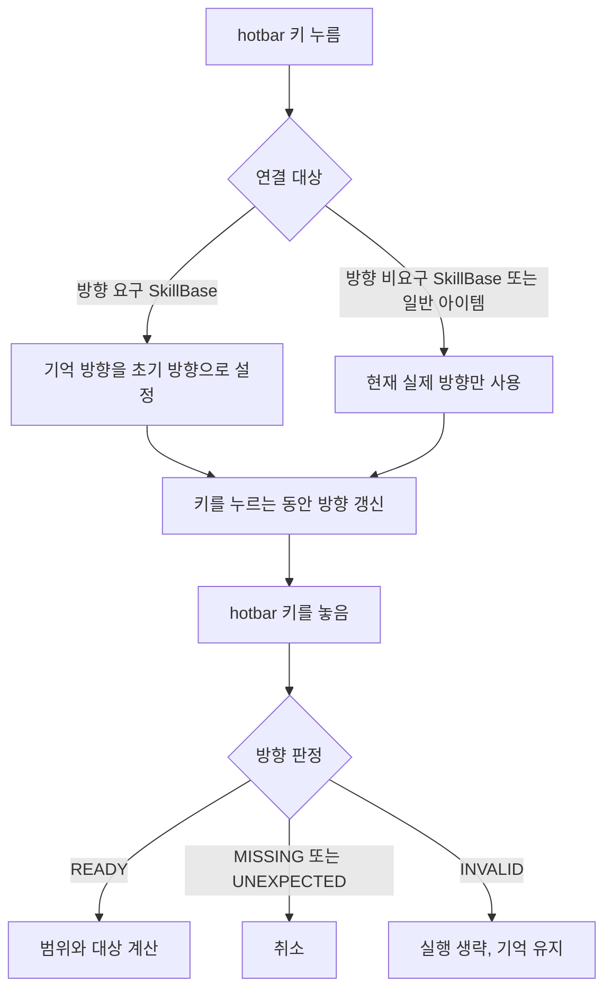

# 스킬 입력과 실행 흐름

## 책임 경계

- `Game.read_inputs()`는 키의 현재 상태와 `keydown`·`keyup` 전이만 수집한다. 스킬 방향 정책을 판단하지 않는다.
- `DungeonScene`은 hotbar 키를 누르는 동안의 입력 세션, 방향 요구 스킬끼리 공유하는 기억 방향, 키를 놓았을 때의 사용·취소·실행 생략을 관리한다.
- `SkillBase`는 방향 요구 여부, 대각선 허용 여부, 방향 판정 결과, 방향에 따른 범위 회전과 명시적으로 전달된 원점 기준 대상 타일 계산을 관리한다.
- `SkillEffect`는 방향키를 직접 알지 않는다. scene이 범위로 대상을 결정한 뒤 효과 판정과 적용에 대상만 전달한다.
- `UsableItem`은 아이템이 가진 `skillbase`의 효과 실행을 위임한다. hotbar에 등록된 `skillbase` 아이템의 방향 선택은 일반 스킬과 같은 scene 입력 흐름을 사용한다.
- `SkillInstance.level`은 `LearnableSkill`의 미투자 상태를 위해 0부터 시작할 수 있다. 기본적으로 음수 레벨은 금지하지만 `SkillBase.allow_negative_level`이 참인 스킬은 음수 레벨도 허용한다. `DungeonInventory`의 전투 스킬 집계와 패시브 계산에는 레벨이 0이 아닌 인스턴스가 들어간다.
- 모든 스킬 정의는 `SkillBase.description`에 UI용 설명을 보관하며, `ActiveSkill` 생성 시에도 설명을 전달할 수 있다.
- `SkillBase.get_icon()`은 `skill_code`를 기준으로 `assets/images/skills/{skill_code}.png`를 조회하고 캐시한다. 파일이 없는 스킬도 공용 코드 스프라이트 로더가 만든 대체 아이콘을 반환한다.
- `DungeonInventory.learnable_skills`는 티어마다 독립된 포인트를 사용한다. `invest_skill(...)`은 항목의 티어 포인트가 남고 `LearnableSkill.max_level`에 도달하지 않았을 때만 레벨을 1 올린다.
- `DungeonInventory.hotbar_skill_codes`는 현재 보유한 합산 액티브 스킬의 코드를 단축키에 연결한다. 같은 스킬 코드는 퀵슬롯 전체에서 하나만 장착할 수 있으며, 다른 슬롯에 장착하면 기존 슬롯에서 해제된 뒤 새 슬롯으로 이동한다. 던전에서 단축키를 실행할 때는 아이템, 인벤토리에 장착한 액티브 스킬, 기본 hotbar 스킬 순으로 실행 대상을 결정한다.
- `SkillBase.max_level`과 `LearnableSkill.max_level`의 `None`은 레벨 상한이 없음을 뜻한다. 학습 항목의 상한을 명시하면 스킬 정의에 상한이 있는 경우 그 이하에서 영웅별 투자 상한을 제한한다. 실제 액티브·패시브 스킬 콘텐츠는 `skills/implementations/` 아래의 종류별 폴더에 둔다.
- 능력치 패시브는 모두 레벨 상한이 없고 음수 레벨을 허용한다. `StatIncreaseEffect`가 대상 속성에 레벨당 증감량, 레벨과 중첩을 곱해 적용하므로 음수 레벨은 해당 스탯을 감소시킨다.
- 영웅 학습 스킬과 장비 스킬처럼 출처가 다른 동일 `skill_code`의 스킬은 각 인스턴스의 `level × stack`을 더해 하나의 `SkillInstance`로 정규화한다. 원본 `SkillBase.max_level`이 있으면 합산 레벨은 그 상한을 넘지 않으며, 합산 결과의 `stack`은 1이다.

## 방향 판정

`SkillBase.check_direction(...)`은 외부 호출자가 조건을 다시 조합하지 않도록 다음 결과를 반환한다.

| 결과 | 의미 | hotbar 처리 |
|---|---|---|
| `READY` | 방향 조건을 만족함 | 사용 진행 |
| `MISSING` | 방향 요구 스킬에 방향이 없음 | 취소 |
| `UNEXPECTED` | 방향 비요구 스킬에 방향이 있음 | 취소 |
| `INVALID` | 방향은 있지만 대각선 허용 같은 제약에 맞지 않음 | 기억 방향을 유지하고 실행만 생략 |

`accepts_direction(...)`은 결과가 `READY`인지 확인하는 편의 함수다. `get_range_vectors(...)`도 같은 판정을 먼저 수행하므로 방향 조건에 맞지 않는 외부 호출은 빈 범위를 받는다.

유효한 방향은 각 축이 `-1`, `0`, `1` 중 하나이고 `(0, 0)`이 아닌 8방향 단위 벡터다. 범위를 의도치 않게 확대하는 `(2, 0)` 같은 값과, 반대 방향키가 동시에 눌려 상쇄된 `(0, 0)`은 `INVALID`로 처리한다.

## 명시적 입력 계약

- 대상 타일 계산은 `SkillTargetingInput(origin, direction)`을 `SkillBase.get_target_tiles(...)`에 전달한다.
- `origin`은 scene이 알고 있는 시전자의 현재 타일 좌표이며, `SkillBase`는 scene이나 player 객체에서 위치를 직접 조회하지 않는다.
- 전투 효과 실행은 기존처럼 `SkillBase.can_use(caster, target)`, `peek(caster, target)`, `use(caster, target, rng)`에 시전자와 대상을 명시적으로 전달한다.
- 타일 원점만 필요한 대상 계산에 전체 캐릭터 객체를 넘기지 않고, 공격력·MP처럼 전투 상태가 필요한 효과 실행에만 `Unit`을 넘긴다.

## hotbar 상태 전이

- 방향 요구 스킬이 성공하면 그 방향을 기억한다.
- 방향 비요구 스킬과 일반 아이템은 기억 방향을 읽거나 변경하지 않는다.
- 입력 중 새 방향을 누르면 기억 방향 대신 새 방향을 사용한다. 새 방향을 모두 놓은 뒤 hotbar 키를 놓으면 방향 요구 스킬은 취소된다.

## 효과 실행 경계

현재 `DungeonScene.use_hotbar_skill(...)`은 방향 범위를 상대 타일로 변환하고 호출 정보를 기록하는 대상 지정 단계까지 담당한다. 실제 몬스터 선택, 다중 대상 비용 지불 규칙 및 `SkillBase.use(...)` 호출은 아직 연결되지 않았다. 이 단계가 구현되기 전에는 scene에서 임의로 대상마다 `use(...)`를 반복하지 않는다. 그러면 다중 대상 스킬이 MP 비용을 대상 수만큼 지불할 수 있기 때문이다.
