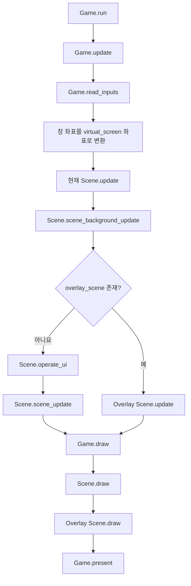
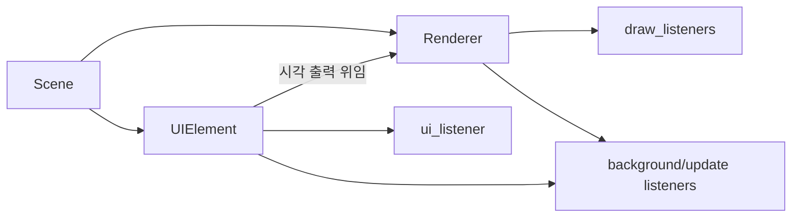
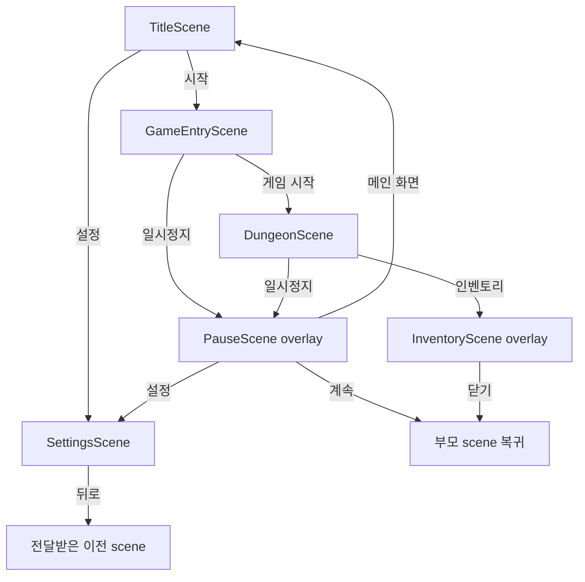
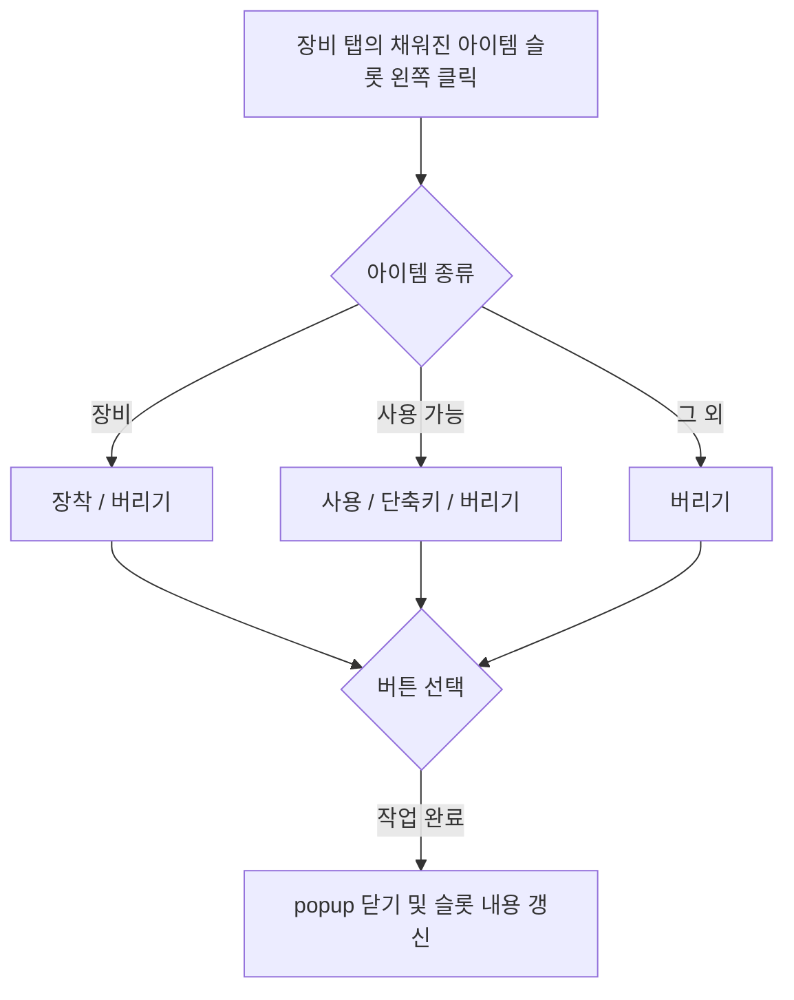

# UI 구조와 흐름

## 프레임 처리



- Pygame 이벤트 큐는 `Game.read_inputs()`에서 한 번만 읽는다.
- 마우스 좌표는 letterbox를 제외한 `virtual_screen` 좌표로 변환되며, 화면 밖이면 `None`이다.
- background listener는 overlay 유무와 관계없이 갱신된다. overlay가 있으면 부모 scene의 일반 UI와 update 대신 overlay가 입력과 업데이트를 처리한다.
- draw listener는 `draw_layer`, 위쪽 좌표, 왼쪽 좌표 순으로 정렬되어 그려진다. 부모 scene을 그린 뒤 overlay를 그린다.
- `DebugGame`은 같은 흐름에 개발 HUD의 update와 draw를 추가한다.

## UI 구성과 상호작용



- `Renderer`는 `Transform`을 상속하고 생성 시 `draw_listeners`에 등록된다. 갱신이 필요한 renderer는 설정에 따라 background 또는 update listener에도 등록된다.
- `UIElement`는 focus와 클릭 영역을 담당하며 시각 출력은 연결된 `Renderer`가 맡는다.
- UI focus는 `ui_listener`를 역순으로 검사하므로 나중에 생성한 UI가 우선한다. focus 변경 시 `on_exit()`와 `on_enter()`를 호출하고, focus 대상에는 hover 후 왼쪽·오른쪽·휠 클릭 순으로 하나의 click hook을 호출한다.
- 부모·자식 UI는 부모를 먼저 생성하고 자식을 나중에 생성한 뒤 `add_sub_ui(...)`로 연결한다.
- 던전 HUD의 HP·MP 바는 `DungeonInventory.get_stat()`으로 계산된 최대 HP·MP를 표시하고, 몬스터 인스펙트의 피해·명중·치명 미리보기도 같은 합산 능력치를 공격자 능력치로 사용한다.
- 던전 화면, 인벤토리 스킬 탭과 소모품 단축키 popup은 모두 공용 `ShortcutBar`와 `ShortcutSlot`을 사용한다. 키 라벨, 아이템 이미지와 수량, 스킬명, 활성 강조의 표현은 공통이며, 바의 중심 위치, 열 수, 슬롯 너비·높이와 가로·세로 간격은 생성 또는 `set_layout(...)` 입력으로 제어한다.
- 스킬 카드와 장착된 스킬의 단축키 슬롯은 `skill_code`에 해당하는 `assets/images/skills/{skill_code}.png` 아이콘을 공통으로 표시한다. 아이템도 같은 방식으로 `item_code` 기반 이미지를 표시하며, 장착된 아이템이나 스킬에 해당 파일이 없으면 코드별 색상이 정해진 사각형 대체 아이콘을 표시한다. 아무것도 장착하지 않은 단축키 슬롯은 좌측 상단의 키 라벨만 남기고 중앙 콘텐츠는 비운다.
- 인벤토리의 일반 아이템 슬롯·장비 슬롯과 던전 및 인벤토리의 단축키 슬롯에서 아이템 위에 마우스를 올리면 공용 `ItemWindow`가 포인터 옆에 나타난다. 창에는 아이템 이름, 수량과 아이템 클래스의 `get_description()` 결과를 표시하며 빈 슬롯이나 스킬이 장착된 단축키에서는 나타나지 않는다. 스킬 장비는 최대 슬롯 수만큼 스킬 이름과 왼쪽 정렬된 `Lv.N` 열을 표시하고 빈 스킬 행은 `-`, `Lv.-`로 채운다. 모든 아이템은 창 아래쪽 구분선 다음에 흐린 글자로 `get_flavor_text()`를 표시할 수 있다.
- 인벤토리에서 소비 아이템이나 장비 아이템을 클릭해 작업 메뉴가 열린 동안에는 열려 있던 `ItemWindow`를 즉시 닫고, 일반·장비·단축키 슬롯의 hover로 다시 열리지 않게 한다.
- UI나 renderer 제거 시 listener 목록을 직접 수정하지 않고 `destroy()`를 호출한다.

## 화면 전환



- `switch_scene(...)`은 게임의 현재 scene을 교체한다.
- `add_overlay(...)`는 부모 scene을 유지한 채 overlay를 연결한다.
- overlay의 `exit_scene()`은 부모와의 연결을 해제하여 기존 scene으로 돌아간다.
- `SettingsScene`은 전달받은 이전 scene으로 돌아가며, 이전 scene이 없으면 제목 화면으로 이동한다.

## 인벤토리 overlay 상세 흐름

### 열기와 기본 배치

- `DungeonScene`에서 인벤토리 입력을 받으면 `InventoryScene`을 overlay로 추가한다. 부모 dungeon 화면은 뒤에 그대로 그려지지만 일반 update와 UI 입력은 멈추고 인벤토리가 입력을 독점한다.
- overlay는 가상 화면 중앙에 `960 × 600` 패널을 표시하고, 패널 밖의 게임 화면에는 반투명 어두운 막을 그린다.
- 패널 위쪽에는 `장비`, `스킬`, `영웅`, `스탯` 탭이 가로로 배치된다. 탭을 바꾸면 열려 있던 아이템 popup은 닫힌다.
- `Tab`을 누르면 인벤토리를 즉시 닫는다. `Escape`는 popup이 열려 있으면 popup만 닫고, popup이 없을 때 인벤토리 overlay를 닫는다.

### 탭별 구성

| 탭 | 표시 내용 | 상호작용 |
|---|---|---|
| `장비` | 위쪽에 무기·보조 무기·방어구·장신구 1·장신구 2 슬롯, 아래쪽에 10열 × 2행의 아이템 슬롯 20개 | 장착 슬롯을 왼쪽 클릭하면 해제한다. 아이템 슬롯을 왼쪽 클릭하면 작업 버튼을 열고, 장비 아이템을 오른쪽 클릭하면 즉시 장착한다. 장비 종류 라벨은 슬롯 위에 표시하고 장비 이미지는 슬롯 내부를 비율 왜곡 없이 최대한 사용한다. |
| `스킬` | 위쪽에 `1`, `2`, `3`, `4`, `Q`, `W`, `E`, `R`에 대응하는 4열 × 2행 슬롯을, 아래쪽 박스에 `DungeonInventory.active_skills()`의 액티브 스킬 카드를 4열로 표시한다. 카드 박스는 스크롤 없이 3행까지 보인다. | 아래 카드 하나를 선택한 뒤 위 단축키 슬롯을 누르면 해당 액티브 스킬을 장착한다. 선택한 카드는 강조 테두리로 표시하며, 아이템 단축키와 스킬 장착은 같은 슬롯에서 서로 교체된다. 같은 스킬을 다른 슬롯에 장착하면 기존 슬롯에서 해제되고 새 슬롯으로 이동한다. |
| `영웅` | 티어별 세로 열과 그 안의 스킬 카드. 헤더에 해당 티어 전용 Skill Point를 표시한다. | 카드 오른쪽 위의 `Lv.N [+]` 버튼으로 포인트를 1 소비해 투자한다. |
| `스탯` | `플레이어`·`패시브` 하위 탭을 표시한다. `플레이어`에는 기본·공격·방어·수집 능력을 네 개 열로 표시하고, `패시브`에는 현재 적용 중인 패시브 스킬 카드를 사각형 영역 안에 격자로 표시한다. | 두 하위 탭을 눌러 전환할 수 있으며 플레이어 능력치는 장비와 패시브를 반영한 읽기 전용 값이다. 패시브 카드가 영역 높이를 넘으면 마우스 휠로 세로 스크롤한다. |

영웅 탭에서 마우스 휠은 포인터가 올라간 티어 열의 카드를 위아래로 스크롤한다. 티어명과 해당 티어의 Skill Point는 카드 스크롤 상자와 분리된 위쪽 고정 헤더 상자에 표시하고 두 줄 사이에 여백을 둔다. 탭의 별도 섹션 제목은 헤더와 겹치지 않도록 출력하지 않는다. 카드 상자의 높이를 늘리지 않고 아래 여백을 넓혀 가로 스크롤 입력 영역을 확보하며, 가로 스크롤바는 패널 아래쪽에 붙여 표시한다. 공용 `SkillCard`는 `48 × 48` 아이콘과 `68px` 높이를 유지하면서 각 화면의 열 폭에 맞게 가로 폭을 조절한다. 액티브·패시브 격자는 한 행에 카드 4개를 표시하고, 영웅 탭도 한 화면에 티어 열 4개가 보이도록 폭을 맞춘다. 아이콘과 구분선은 카드의 세로 중앙에 맞추고 스킬명과 레벨은 구분선 위아래에 같은 간격으로 배치한다. `SkillInvestButton`은 구분선과 닿지 않으면서 레벨 텍스트의 세로 중심에 정렬한다. 포인트가 없거나 항목별 최대 레벨이면 버튼을 비활성화한다.

스킬 카드의 아이콘에 마우스를 올리면 공용 `SkillInfoWindow`가 포인터 옆에 나타난다. 카드와 검은 정보창 첫 줄에는 현재 레벨과 최대 레벨을 `Lv.N/M`으로 표시하며, 상한이 없는 스킬은 `Lv.N/∞`로 표시한다. 정보창의 구분선 아래에는 `SkillBase.description`을 너비에 맞춰 줄바꿈한다. 화면 공간을 넘는 내용은 말줄임표로 자른다. `SkillCard`와 `SkillInfoWindow`는 생성 시 `SkillInstance`만 받으면 스킬 정의의 최대 레벨을 사용하며, 선택적 `max_level`을 함께 받으면 해당 커스텀 상한을 표시한다. 영웅 탭의 학습 가능 스킬 카드는 `LearnableSkill.max_level`을 표시하지만, 스탯 탭의 합산된 패시브 카드는 투자 상한과 무관하게 원본 `SkillBase.max_level`을 표시한다.

스킬 카드 아이콘 이미지는 둥근 아이콘 영역 밖을 마스킹해 자르고, 이미지 위에 아이콘 프레임 테두리를 그려 영웅·액티브·패시브 카드에서 동일한 프레임을 유지한다.

장비 탭의 배치는 다음 순서다.

```text
┌──────────────────────────── 인벤토리 패널 ────────────────────────────┐
│       [장비]       [스킬]       [영웅]       [스탯]                   │
│                                                                        │
│       [무기] [보조 무기] [방어구] [장신구 1] [장신구 2]              │
│                                                                        │
│  인벤토리  현재 개수 / 용량                                            │
│  [00][01][02][03][04][05][06][07][08][09]                             │
│  [10][11][12][13][14][15][16][17][18][19]                             │
└────────────────────────────────────────────────────────────────────────┘
```

### 아이템 슬롯 클릭과 작업 버튼

빈 슬롯을 누르면 아무 동작도 하지 않는다. 아이템이 있는 슬롯을 왼쪽 클릭하면 선택한 슬롯 옆에 폭 `104`, 높이 `36`, 간격 `4`의 버튼들이 세로로 나타난다.

- 기본적으로 선택 슬롯의 오른쪽에서 `8px` 떨어진 곳에 표시한다.
- 오른쪽에 popup을 놓으면 패널의 오른쪽 여백 `12px`를 침범하는 경우 선택 슬롯의 왼쪽 `8px` 지점으로 옮긴다.
- popup의 위쪽은 선택 슬롯의 위쪽에 맞추되, 패널 아래쪽을 넘으면 전체 버튼 높이와 아래 여백 `12px`를 확보하도록 위로 올린다.
- 작업 버튼 단계에는 별도의 popup 배경을 그리지 않고 버튼 묶음만 표시한다.

표시되는 버튼은 아이템 종류에 따라 달라진다.

| 선택한 아이템 | 위에서 아래로 표시되는 버튼 |
|---|---|
| 장비(`Equip`) | `장착` → `버리기` |
| `use(...)`를 제공하는 사용 아이템 | `사용` → `단축키` → `버리기` |
| 그 외 아이템 | `버리기` |



- `장착`은 아이템의 장비 유형에 대응하는 슬롯으로 옮긴다. 기존 장비가 있으면 선택한 인벤토리 칸과 기존 장비를 교환하고, 비어 있으면 선택 아이템을 인벤토리 목록에서 제거한다.
- 장착·교환·해제에 필요한 인벤토리 목록과 장비 슬롯의 동시 변경은 `DungeonInventory`가 원자적으로 처리하며 scene은 해당 연산만 요청한다.
- 아이템 슬롯을 오른쪽 클릭해도 같은 장착 처리를 바로 수행한다. 장비가 아닌 아이템을 오른쪽 클릭하면 아무 동작도 하지 않는다.
- 위쪽의 장착 슬롯을 왼쪽 클릭하면 해당 장비를 인벤토리로 되돌린다. 인벤토리에 추가할 공간이 없거나 아이템이 해제 조건을 거부하면 장착 상태를 유지한다.
- `사용`은 부모 `DungeonScene`의 player를 대상으로 아이템의 `use(...)`를 호출한다. 성공 결과가 반환된 경우 수량을 1개 줄이고 popup을 닫는다.

### 버리기 popup

`버리기`를 누르면 작업 버튼을 수량 선택 popup으로 교체한다.

```text
┌────── 버릴 수량 ──────┐
│   [<]     수량     [>] │
│ [버리기]       [취소] │
└────────────────────────┘
```

- popup 크기는 `164 × 118`이며 작업 버튼과 같은 좌우 배치 규칙을 사용한다.
- 초기 수량은 `1`이다. `<`와 `>`는 수량을 1씩 변경하며 범위는 `1`부터 현재 stack 수량까지다.
- 아래쪽 왼편의 `버리기`는 선택 수량을 인벤토리에서 제거하고 popup을 닫는다.
- 아래쪽 오른편의 `취소`는 아이템과 수량을 변경하지 않고 popup을 닫는다.

### 단축키 선택 popup

사용 아이템의 `단축키`를 누르면 화면 중앙에 `352 × 220` popup이 나타난다.

```text
┌────────────── 단축키 선택 ──────────────┐
│     [1]     [2]     [3]     [4]          │
│     [Q]     [W]     [E]     [R]          │
└───────────────────────────────────────────┘
```

- 평소 스킬 탭에서 사용하던 공용 `ShortcutBar`를 `set_layout(...)`으로 popup 안의 4열 × 2행 위치로 임시 이동하고 draw layer를 높여 popup 위에 표시한다.
- 슬롯 하나를 누르면 선택한 아이템 인스턴스를 해당 키의 `hotbar_items`에 지정하고 popup을 닫는다.
- popup이 닫히면 슬롯을 스킬 탭의 원래 위치와 draw layer로 복원한다.
- 이미 다른 스킬이나 아이템이 연결된 키를 선택하면 해당 키의 아이템 연결값을 새 아이템으로 교체한다.

### 스킬 방향 입력

- 일반 hotbar 스킬과 `skillbase`를 가진 hotbar 아이템은 같은 방향 입력 흐름을 사용한다.
- `requires_direction=True`인 스킬은 마지막으로 사용한 방향을 다음 방향 요구 스킬의 초기 방향으로 공유한다. 입력 중 새 방향키를 누르면 현재 조합으로 바꾸며, 새로 누른 방향키를 모두 놓으면 취소한다.
- 방향 요구 스킬은 유효한 현재 또는 기억 방향이 있을 때 사용한다.
- `requires_direction=False`인 스킬은 중립일 때 사용하며 방향키가 눌려 있으면 취소한다.
- 방향 비요구 스킬과 일반 사용 아이템은 기억 방향을 읽거나 변경하지 않는다. 일반 사용 아이템도 hotbar 키를 놓는 순간 중립이면 사용하고, 방향키가 눌려 있으면 취소한다.
- hotbar의 `4`와 `R` 슬롯 사이 오른쪽에 있는 작은 8방향 나침반은 방향 요구 스킬끼리 공유하는 기억 방향을 화살표로 표시한다.
- 기억 방향이 대각선인데 현재 스킬이 대각선을 허용하지 않는 경우처럼 방향 제약이 맞지 않으면, 기억 방향은 유지하고 스킬만 사용하지 않는다.

### popup 닫기 규칙

- popup이 열린 상태에서 popup 바깥을 왼쪽 클릭하면 popup을 닫는다.
- popup을 처음 연 클릭이나 popup 내부 버튼을 누른 같은 프레임에는 바깥 클릭 판정을 하지 않아 즉시 닫히는 것을 방지한다.
- popup을 닫으면 선택 아이템, popup 영역, 버릴 수량을 초기화하고 모든 popup 버튼을 숨긴다.
- 단축키 popup이었다면 hotbar 슬롯 위치도 원래대로 복구한다.
