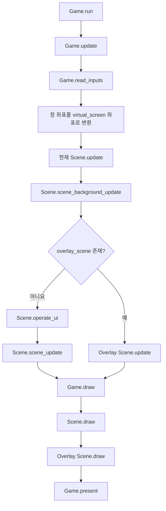
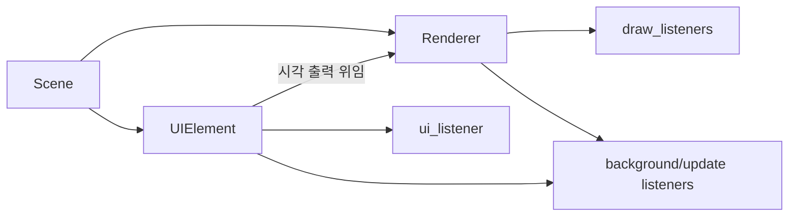
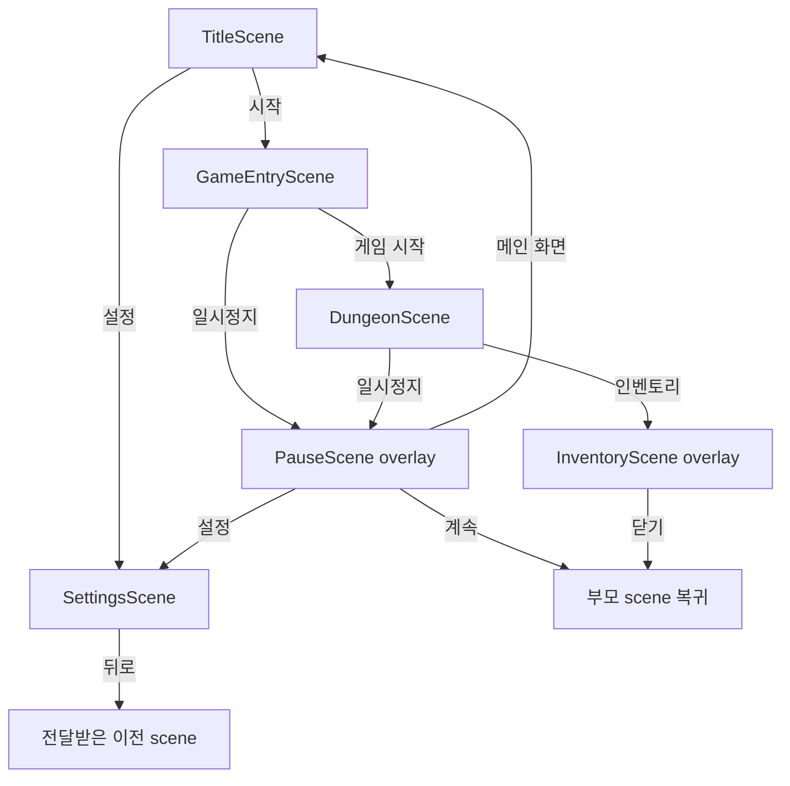
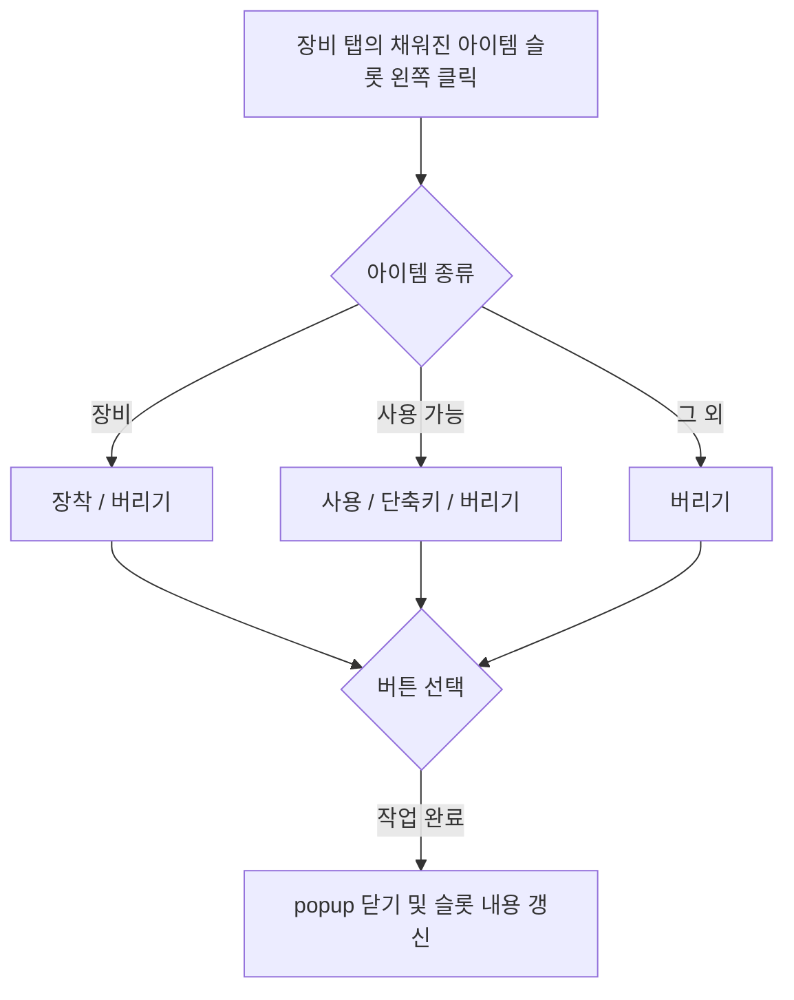

# UI 구조와 흐름

## 프레임 처리



- Pygame 이벤트 큐는 `Game.read_inputs()`에서 한 번만 읽는다.
- 마우스 좌표는 letterbox를 제외한 `virtual_screen` 좌표로 변환되며, 화면 밖이면 `None`이다.
- background listener는 overlay 유무와 관계없이 갱신된다. overlay가 있으면 부모 scene의 일반 UI와 update 대신 overlay가 입력과 업데이트를 처리한다.
- draw listener는 `draw_layer`, 위쪽 좌표, 왼쪽 좌표 순으로 정렬되어 그려진다. 부모 scene을 그린 뒤 overlay를 그린다.
- `DebugGame`은 같은 흐름에 개발 HUD의 update와 draw를 추가한다.

## UI 구성과 상호작용



- `Renderer`는 `Transform`을 상속하고 생성 시 `draw_listeners`에 등록된다. 갱신이 필요한 renderer는 설정에 따라 background 또는 update listener에도 등록된다.
- `UIElement`는 focus와 클릭 영역을 담당하며 시각 출력은 연결된 `Renderer`가 맡는다.
- UI focus는 `ui_listener`를 역순으로 검사하므로 나중에 생성한 UI가 우선한다. focus 변경 시 `on_exit()`와 `on_enter()`를 호출하고, focus 대상에는 hover 후 왼쪽·오른쪽·휠 클릭 순으로 하나의 click hook을 호출한다.
- 부모·자식 UI는 부모를 먼저 생성하고 자식을 나중에 생성한 뒤 `add_sub_ui(...)`로 연결한다.
- UI나 renderer 제거 시 listener 목록을 직접 수정하지 않고 `destroy()`를 호출한다.

## 화면 전환



- `switch_scene(...)`은 게임의 현재 scene을 교체한다.
- `add_overlay(...)`는 부모 scene을 유지한 채 overlay를 연결한다.
- overlay의 `exit_scene()`은 부모와의 연결을 해제하여 기존 scene으로 돌아간다.
- `SettingsScene`은 전달받은 이전 scene으로 돌아가며, 이전 scene이 없으면 제목 화면으로 이동한다.

## 인벤토리 overlay 상세 흐름

### 열기와 기본 배치

- `DungeonScene`에서 인벤토리 입력을 받으면 `InventoryScene`을 overlay로 추가한다. 부모 dungeon 화면은 뒤에 그대로 그려지지만 일반 update와 UI 입력은 멈추고 인벤토리가 입력을 독점한다.
- overlay는 가상 화면 중앙에 `960 × 600` 패널을 표시하고, 패널 밖의 게임 화면에는 반투명 어두운 막을 그린다.
- 패널 위쪽에는 `장비`, `스킬`, `영웅`, `스탯` 탭이 가로로 배치된다. 탭을 바꾸면 열려 있던 아이템 popup은 닫힌다.
- `Tab`을 누르면 인벤토리를 즉시 닫는다. `Escape`는 popup이 열려 있으면 popup만 닫고, popup이 없을 때 인벤토리 overlay를 닫는다.

### 탭별 구성

| 탭 | 표시 내용 | 상호작용 |
|---|---|---|
| `장비` | 위쪽에 무기·보조 무기·방어구·장신구 1·장신구 2 슬롯, 아래쪽에 10열 × 2행의 아이템 슬롯 20개 | 장착 슬롯을 왼쪽 클릭하면 해제한다. 아이템 슬롯을 왼쪽 클릭하면 작업 버튼을 열고, 장비 아이템을 오른쪽 클릭하면 즉시 장착한다. |
| `스킬` | `1`, `2`, `3`, `4`, `Q`, `W`, `E`, `R`에 대응하는 4열 × 2행 슬롯 | 현재 hotbar 아이템 또는 스킬 이름을 보여준다. 일반 스킬 탭에서 슬롯을 눌러도 아이템 지정은 일어나지 않는다. |
| `영웅` | 현재 별도 콘텐츠 없음 | 탭 전환만 가능하다. |
| `스탯` | 기본·공격·방어·수집 능력을 네 개 열로 표시 | 장비를 반영해 계산한 현재 능력치를 읽기 전용으로 보여준다. |

장비 탭의 배치는 다음 순서다.

```text
┌──────────────────────────── 인벤토리 패널 ────────────────────────────┐
│       [장비]       [스킬]       [영웅]       [스탯]                   │
│                                                                        │
│       [무기] [보조 무기] [방어구] [장신구 1] [장신구 2]              │
│                                                                        │
│  인벤토리  현재 개수 / 용량                                            │
│  [00][01][02][03][04][05][06][07][08][09]                             │
│  [10][11][12][13][14][15][16][17][18][19]                             │
└────────────────────────────────────────────────────────────────────────┘
```

### 아이템 슬롯 클릭과 작업 버튼

빈 슬롯을 누르면 아무 동작도 하지 않는다. 아이템이 있는 슬롯을 왼쪽 클릭하면 선택한 슬롯 옆에 폭 `104`, 높이 `36`, 간격 `4`의 버튼들이 세로로 나타난다.

- 기본적으로 선택 슬롯의 오른쪽에서 `8px` 떨어진 곳에 표시한다.
- 오른쪽에 popup을 놓으면 패널의 오른쪽 여백 `12px`를 침범하는 경우 선택 슬롯의 왼쪽 `8px` 지점으로 옮긴다.
- popup의 위쪽은 선택 슬롯의 위쪽에 맞추되, 패널 아래쪽을 넘으면 전체 버튼 높이와 아래 여백 `12px`를 확보하도록 위로 올린다.
- 작업 버튼 단계에는 별도의 popup 배경을 그리지 않고 버튼 묶음만 표시한다.

표시되는 버튼은 아이템 종류에 따라 달라진다.

| 선택한 아이템 | 위에서 아래로 표시되는 버튼 |
|---|---|
| 장비(`Equip`) | `장착` → `버리기` |
| `use(...)`를 제공하는 사용 아이템 | `사용` → `단축키` → `버리기` |
| 그 외 아이템 | `버리기` |



- `장착`은 아이템의 장비 유형에 대응하는 슬롯으로 옮긴다. 기존 장비가 있으면 선택한 인벤토리 칸과 기존 장비를 교환하고, 비어 있으면 선택 아이템을 인벤토리 목록에서 제거한다.
- 아이템 슬롯을 오른쪽 클릭해도 같은 장착 처리를 바로 수행한다. 장비가 아닌 아이템을 오른쪽 클릭하면 아무 동작도 하지 않는다.
- 위쪽의 장착 슬롯을 왼쪽 클릭하면 해당 장비를 인벤토리로 되돌린다. 인벤토리에 추가할 공간이 없거나 아이템이 해제 조건을 거부하면 장착 상태를 유지한다.
- `사용`은 부모 `DungeonScene`의 player를 대상으로 아이템의 `use(...)`를 호출한다. 성공 결과가 반환된 경우 수량을 1개 줄이고 popup을 닫는다.

### 버리기 popup

`버리기`를 누르면 작업 버튼을 수량 선택 popup으로 교체한다.

```text
┌────── 버릴 수량 ──────┐
│   [<]     수량     [>] │
│ [버리기]       [취소] │
└────────────────────────┘
```

- popup 크기는 `164 × 118`이며 작업 버튼과 같은 좌우 배치 규칙을 사용한다.
- 초기 수량은 `1`이다. `<`와 `>`는 수량을 1씩 변경하며 범위는 `1`부터 현재 stack 수량까지다.
- 아래쪽 왼편의 `버리기`는 선택 수량을 인벤토리에서 제거하고 popup을 닫는다.
- 아래쪽 오른편의 `취소`는 아이템과 수량을 변경하지 않고 popup을 닫는다.

### 단축키 선택 popup

사용 아이템의 `단축키`를 누르면 화면 중앙에 `352 × 220` popup이 나타난다.

```text
┌────────────── 단축키 선택 ──────────────┐
│     [1]     [2]     [3]     [4]          │
│     [Q]     [W]     [E]     [R]          │
└───────────────────────────────────────────┘
```

- 평소 스킬 탭에서 사용하던 8개의 hotbar 슬롯을 popup 안의 4열 × 2행 위치로 임시 이동하고 draw layer를 높여 popup 위에 표시한다.
- 슬롯 하나를 누르면 선택한 아이템 인스턴스를 해당 키의 `hotbar_items`에 지정하고 popup을 닫는다.
- popup이 닫히면 슬롯을 스킬 탭의 원래 위치와 draw layer로 복원한다.
- 이미 다른 스킬이나 아이템이 연결된 키를 선택하면 해당 키의 아이템 연결값을 새 아이템으로 교체한다.

### popup 닫기 규칙

- popup이 열린 상태에서 popup 바깥을 왼쪽 클릭하면 popup을 닫는다.
- popup을 처음 연 클릭이나 popup 내부 버튼을 누른 같은 프레임에는 바깥 클릭 판정을 하지 않아 즉시 닫히는 것을 방지한다.
- popup을 닫으면 선택 아이템, popup 영역, 버릴 수량을 초기화하고 모든 popup 버튼을 숨긴다.
- 단축키 popup이었다면 hotbar 슬롯 위치도 원래대로 복구한다.
